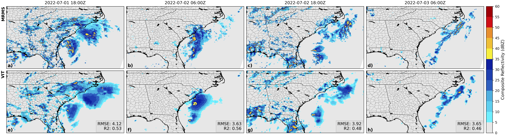

# (SR-ViT) Satellite to Radar Transformer
Official implementation of *SR-ViT: Vision Transformers for Estimating Radar Reflectivity from Satellite Observations at Scale*

    
    <em>Tropical Cyclone Colin</em>

Overview of project structure:
- [src/](src/): models, trainer, evaluation scripts
- [scripts/](scripts/): scripts for training and testing on SLURM
- [weights/](weights/): trained model weights
- [plotting/](plotting/): scripts for visualizing results
- [dataprep/](dataprep/): scripts to convert raw data into numpy
- [notebooks/](notebooks/): notebooks for data exploration and visualization

**Note**: pathnames need to be updated in the scripts to point to the correct directories.

### Data Preparation

Satellite and radar data from 2020-2022 are available to download here:

Hilburn, K., 2023: GREMLIN CONUS3 Dataset for 2020, Dryad, Dataset, https://doi.org/10.5061/dryad.h9w0vt4nq.
Hilburn, K., 2023: GREMLIN CONUS3 Dataset for 2021, Dryad, Dataset, https://doi.org/10.5061/dryad.zs7h44jf2.
Hilburn, K., 2023: GREMLIN CONUS3 Dataset for 2022, Dryad, Dataset, https://doi.org/10.5061/dryad.2jm63xstt.

Preprocessing scripts are available in [`dataprep/`](dataprep/) to convert the raw data into numpy.

### Training

The training scripts are available in [`scripts/`](scripts/) which call [`src/main.py`](src/main.py) with the correct arguments, see `python src/main.py --help` for more information.

### Evaluation

**Model Evaluation**: Evaluations are performed using the `src/*eval.py` scripts. The best model is loaded with with the arguments `--test` and `--save` and the results are saved to the `--data-dir/<out>/<experiment>` directory. Metrics are computed with [`src/results.py`](src/results.py) and sharpness with [`src/grad.py`](src/grad.py) given the model directory with saved predictions.

**Token (Re)Distribution**: source code is available under [`src/dzdxutils.py`](src/dzdxutils.py) with an example of running and plotting in [`notebooks/dzdx.ipynb`](notebooks/dzdx.ipynb). It is assumed that the model has been trained and the weights are saved.