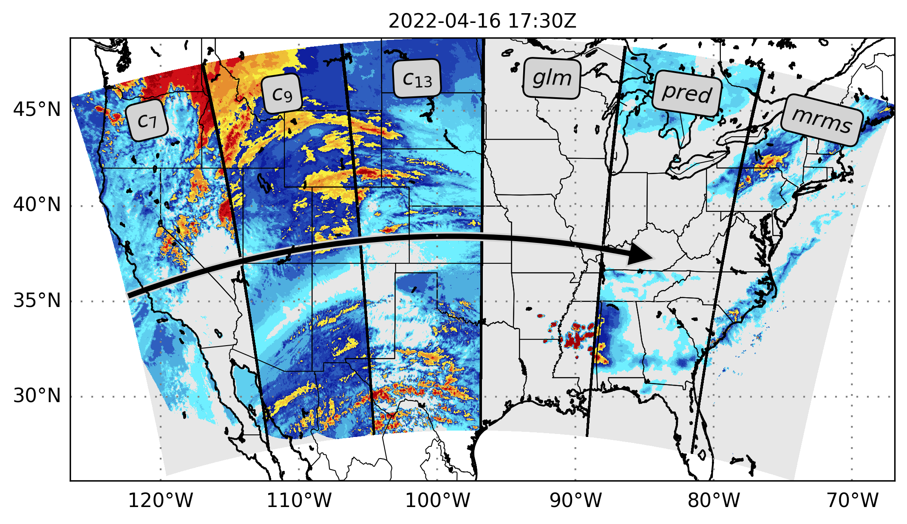

# 🛰️ SRViT: Vision Transformers for Estimating Radar Reflectivity from Satellite Observations at Scale

<p align="center">
    
    <br/>
    Jason Stock, Kyle Hilburn, Imme Ebert-Uphoff, Charles Anderson
    <br/>
    <span>
        [<a href='https://arxiv.org/abs/2406.16955' target="_blank" rel="noopener noreferrer">paper</a>]
        [<a href='#citation'>citation</a>]
    </span>
</p>

**Abstract**: We introduce a transformer-based neural network to generate high-resolution (3km) synthetic radar reflectivity fields at scale from geostationary satellite imagery. This work aims to enhance short-term convective-scale forecasts of high-impact weather events and aid in data assimilation for numerical weather prediction over the United States. Compared to convolutional approaches, which have limited receptive fields, our results show improved sharpness and higher accuracy across various composite reflectivity thresholds. Additional case studies over specific atmospheric phenomena support our quantitative findings, while a novel attribution method is introduced to guide domain experts in understanding model outputs.

Overview of project structure:
- [src/](src/): models, trainer, evaluation scripts
- [scripts/](scripts/): scripts for training and testing on SLURM
- [weights/](weights/): trained model weights
- [plotting/](plotting/): scripts for visualizing results
- [dataprep/](dataprep/): scripts to convert raw data into numpy
- [notebooks/](notebooks/): notebooks for data exploration and visualization

**Note**: path names need to be updated in the scripts to point to the correct directories.

### Data Preparation

Satellite and radar data from 2020-2022 are available to download here:

Hilburn, K., 2023: GREMLIN CONUS3 Dataset for 2020, Dryad, Dataset, https://doi.org/10.5061/dryad.h9w0vt4nq.
Hilburn, K., 2023: GREMLIN CONUS3 Dataset for 2021, Dryad, Dataset, https://doi.org/10.5061/dryad.zs7h44jf2.
Hilburn, K., 2023: GREMLIN CONUS3 Dataset for 2022, Dryad, Dataset, https://doi.org/10.5061/dryad.2jm63xstt.

Preprocessing scripts are available in [`dataprep/`](dataprep/) to convert the raw data into numpy.

### Training

The training scripts are available in [`scripts/`](scripts/) which call [`src/main.py`](src/main.py) with the correct arguments, see `python src/main.py --help` for more information.

### Evaluation

**Model Evaluation**: Evaluations are performed using the `src/*eval.py` scripts. The best model is loaded with with the arguments `--test` and `--save` and the results are saved to the `--data-dir/<out>/<experiment>` directory. Metrics are computed with [`src/results.py`](src/results.py) and sharpness with [`src/grad.py`](src/grad.py) given the model directory with saved predictions.

**Token (Re)Distribution**: source code is available under [`src/dzdxutils.py`](src/dzdxutils.py) with an example of running and plotting in [`notebooks/dzdx.ipynb`](notebooks/dzdx.ipynb). It is assumed that the model has been trained and the weights are saved.

<a id="citation"></a>
### Citation

```
@inproceedings{stock2024srvit,
  title={SRViT: Vision Transformers for Estimating Radar Reflectivity from Satellite Observations at Scale},
  author={Stock, Jason and Hilburn, Kyle and Ebert-Uphoff, Imme and Anderson, Charles},
  booktitle={ICML 2024 Workshop on Machine Learning for Earth System Modeling},
  year={2024},
  month={July}
}
```
